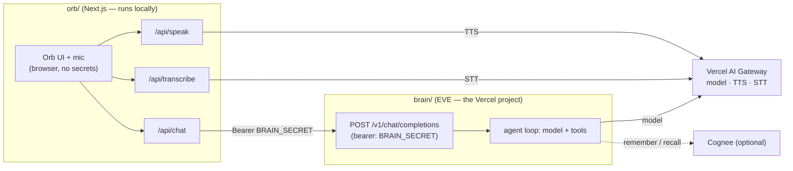

# PRD — Jarvis-Style Agent

A technical specification for the system this guide builds. Read it for the *what* and the *contracts*;
the `guide/` steps are the *how*. Terminology: **the user** is the human who runs the coding agent and
owns the result; **the agent** is the coding agent building from this guide.

## Purpose

Build a voice agent: a particle-orb web frontend the user talks to, backed by an agent brain on Vercel,
where the user can say "hello" and hear a spoken reply. The orb runs on the user's machine; the brain is
the deployed surface. The system is recreated from this guide in the user's own repo, on their own
Vercel, with their own keys. No runtime is shipped; the guide ships contracts and verbatim-pinned code.

The deliverable (the "foundation") is: **Frontend running locally, Backend deployed, voice round-trips.**
Context and Memory are specified here and built on request; they do not gate acceptance.

## Concepts (the architectural spine)

Four layers, one pattern.

- **Frontend** — the orb. A Next.js app: renders the orb, captures mic audio, plays TTS audio, holds no
  secrets, contains no model logic.
- **Backend** — the brain. An EVE agent exposing one HTTP door (`POST /v1/chat/completions`,
  OpenAI-compatible). Holds the model key, runs the agent loop.
- **Context** — per-conversation state: the agent's instructions + the live transcript, assembled per
  turn.
- **Memory** — cross-conversation durable state (Cognee). Optional; behind two tools over a swappable
  store.
- **Backend-for-Frontend (BFF)** — the pattern: the frontend calls only one backend the user owns; that
  backend calls every external service. Secrets stay server-side; one home per integration.

## System architecture



The browser talks only to `orb/api/*`. Those routes hold `AI_GATEWAY_API_KEY` (voice) and
`BRAIN_SECRET` (brain bearer). The brain holds `AI_GATEWAY_API_KEY` (model) and `BRAIN_SECRET`
(validation). Full diagrams (request sequence, deploy topology) are in
[`docs/architecture.md`](./docs/architecture.md).

## Folder structure

One repo holds both (`orb/` at the root, `brain/` as a subfolder). The brain is the deployed Vercel
project (Root Directory = `brain`); the orb runs locally and talks to it.

```
<repo root>/                  # the orb (Next.js) — runs locally
  package.json
  tsconfig.json               # "exclude": ["brain"] — keeps the brain out of the orb build
  next.config.ts
  app/
    layout.tsx
    page.tsx                  # renders <Orb/> + <ChatBox/>
    globals.css
    api/
      chat/route.ts           # BFF: proxy a turn to the brain, stream SSE
      speak/route.ts          # BFF: text -> mp3 (TTS), server-side
      transcribe/route.ts     # BFF: audio -> text (STT), server-side
    components/
      Orb.tsx                 # three.js particle orb (uPulse driven by speech amplitude)
      ChatBox.tsx             # mic + stop controls; runs a turn
      voice.ts                # TTS speaker queue + mic recorder + amplitude sampling
      voice-signal.ts         # shared 0..1 "is speaking" amplitude
  lib/
    domain/chat.ts            # ChatMessage + ChatDelta (BFF->browser contract)
    cut-sentences.ts          # split streamed text into sentences for TTS
    openai-sse.ts             # parse OpenAI SSE -> content deltas
    ports/brain.ts            # Brain interface
    adapters/http-brain.ts    # the brain over the shim (always HTTP)
    adapters/brain-select.ts  # pick the brain from env (BRAIN_URL + BRAIN_MODE)
    voice/tts.ts              # pick TTS model + voice by tier

  brain/                      # the brain (EVE) — the Vercel project, Root Directory = brain
    package.json              # type: module, imports "#*": "./agent/*", engines node >=24
    tsconfig.json
    .env.example
    agent/
      agent.ts                # defineAgent({ model: AGENT_MODEL })
      instructions.md         # persona + voice rules (the Context layer)
      channels/
        openai-compat.ts      # the backend API: POST /v1/chat/completions
      tools/                  # (added on extension) remember.ts, recall.ts, custom tools
      lib/                    # (added on extension) notes-store.ts (memory backend)
```

## Backend API

The brain exposes a single OpenAI-compatible endpoint. This is the contract the orb's `http-brain`
adapter (and any other client) depends on. OpenAPI 3.1:

```yaml
openapi: 3.1.0
info:
  title: Jarvis Brain API
  version: 1.0.0
  description: >
    OpenAI-compatible chat-completions endpoint exposed by the EVE brain. Each request is a
    stateless run; the full transcript is sent every turn (no server-side session resume).
servers:
  - url: https://<brain-project>.vercel.app
    description: Production (Vercel)
  - url: http://127.0.0.1:8787
    description: Local (eve dev)
security:
  - brainSecret: []
paths:
  /v1/chat/completions:
    post:
      summary: Run a chat turn and stream the reply
      security:
        - brainSecret: []
      requestBody:
        required: true
        content:
          application/json:
            schema: { $ref: '#/components/schemas/ChatCompletionsRequest' }
      responses:
        '200':
          description: >
            When stream=true (default): an OpenAI SSE stream of chat.completion.chunk objects,
            terminated by a literal `data: [DONE]`. When stream=false: a single chat.completion JSON.
          content:
            text/event-stream:
              schema:
                type: string
                description: 'SSE frames: data: {ChatCompletionChunk}\n\n  ...  data: [DONE]'
            application/json:
              schema: { $ref: '#/components/schemas/ChatCompletion' }
        '400':
          description: No user message present, or malformed body.
          content:
            application/json:
              schema: { $ref: '#/components/schemas/Error' }
        '401':
          description: Missing or invalid bearer (does not match BRAIN_SECRET).
        '500':
          description: BRAIN_SECRET is not configured on the server.
components:
  securitySchemes:
    brainSecret:
      type: http
      scheme: bearer
      description: 'Authorization: Bearer <BRAIN_SECRET>. Same value the orb sends.'
  schemas:
    ChatMessage:
      type: object
      required: [role, content]
      properties:
        role: { type: string, enum: [system, user, assistant] }
        content:
          type: string
          description: 'String, or OpenAI content-parts; parts are flattened to text.'
    ChatCompletionsRequest:
      type: object
      required: [messages]
      properties:
        messages:
          type: array
          items: { $ref: '#/components/schemas/ChatMessage' }
          description: Full transcript so far; the last user message is the turn.
        stream: { type: boolean, default: true }
        model:
          type: string
          description: 'Accepted and ignored; the model is set server-side by AGENT_MODEL.'
        user: { type: string, description: 'Optional caller id; ignored.' }
    ChatCompletionChunk:
      type: object
      description: One streamed delta (OpenAI shape).
      properties:
        id: { type: string }
        object: { type: string, const: chat.completion.chunk }
        created: { type: integer }
        model: { type: string }
        choices:
          type: array
          items:
            type: object
            properties:
              index: { type: integer }
              delta:
                type: object
                properties:
                  role: { type: string, enum: [assistant] }
                  content: { type: string }
              finish_reason: { type: [string, 'null'], enum: [stop, null] }
    ChatCompletion:
      type: object
      description: Non-streamed completion (OpenAI shape).
      properties:
        id: { type: string }
        object: { type: string, const: chat.completion }
        created: { type: integer }
        model: { type: string }
        choices:
          type: array
          items:
            type: object
            properties:
              index: { type: integer }
              message: { $ref: '#/components/schemas/ChatMessage' }
              finish_reason: { type: string, const: stop }
    Error:
      type: object
      properties:
        error:
          oneOf:
            - type: string
            - type: object
              properties:
                message: { type: string }
                type: { type: string }
```

Behavior the pinned implementation enforces (see `guide/02-backend.md`):

- **Stateless per turn.** The whole transcript is sent each request; the brain does not resume a
  long-lived session. Tool calls resolve inside EVE; `tool-calls` is the only non-terminal finish
  reason, so the stream ends on the first non-tool completed message.
- **`model` is accepted but not honored** — the served model is whatever `AGENT_MODEL` is set to (a
  dotted gateway id). The `model` field echoed in responses is the constant `eve-jarvis`.

### Frontend BFF routes (the orb's server layer)

The orb's own HTTP surface, called only by its browser. Not the backend API, but part of the system
contract:

| Method + path | Request | Response | Calls |
| ------------- | ------- | -------- | ----- |
| `POST /api/chat` | `{ messages: ChatMessage[], stream: true }` | SSE of `ChatDelta` (`{type:'delta',text}` / `{type:'done'}` / `{type:'error',error}`) | the brain's `/v1/chat/completions` |
| `POST /api/speak` | `{ text: string, voice?: string }` | `audio/mpeg` (mp3 bytes) | AI Gateway TTS |
| `POST /api/transcribe` | raw audio bytes (e.g. `audio/webm`) | `{ text: string }` | AI Gateway STT |

## Acceptance criteria

The foundation is complete when all hold:

1. The orb loads from localhost (`bun run dev`); the orb renders and animates.
2. The deployed brain answers `POST /v1/chat/completions` for a valid bearer with a streamed
   reply terminated by `data: [DONE]`; an invalid bearer returns `401`.
3. End to end: mic → `POST /api/transcribe` → `POST /api/chat` → brain → streamed reply → per-sentence
   `POST /api/speak` → audio playback; the orb pulses with the audio amplitude.
4. `AGENT_MODEL` is a dotted gateway id; the brain's Vercel build succeeds.
5. `BRAIN_SECRET` is identical on the orb and the brain; `BRAIN_URL` points at the deployed brain.
6. No secret (`AI_GATEWAY_API_KEY`, `BRAIN_SECRET`, model key) appears in the client bundle or any
   request the browser issues directly.

`guide/06-verify.md` is the executable checklist.

## Goals

- Reproducible from the guide with no human action beyond browser sign-ins and pasting keys.
- The user owns 100% of the output: their repo, their Vercel, their keys.
- Every hard-to-get-right piece (the shim, the voice loop, the orb shader, the BFF wiring) is pinned
  verbatim.
- Extensible by adding a file (an EVE tool/skill), never by rewiring the frontend.

## Non-goals

- **No hosted runtime.** The guide ships contracts and code, not a service. Nothing runs on
  infrastructure other than the user's.
- **No pre-built third-party integrations.** Tools/skills (Shopify, analytics, etc.) are
  `guide/07-extensibility.md` examples, built on request.
- **No mobile / native app.** The frontend is a web app.
- **Not a model or voice vendor.** Default model + voice run through the Vercel AI Gateway; swaps are
  documented, no provider lock-in.

## Scope boundary

The guide is responsible for the foundation: Frontend + Backend + deploy + voice round-trip ("hello").
Everything past that (tools, memory, additional surfaces) is built on top using
`guide/07-extensibility.md`, on request. The foundation is intentionally unopinionated about what is
built on it.
