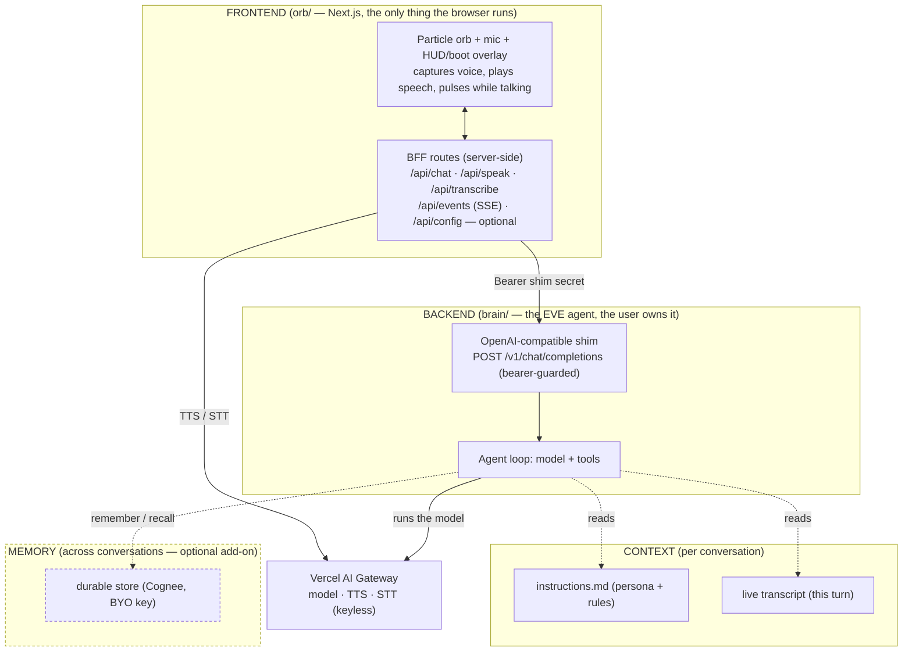
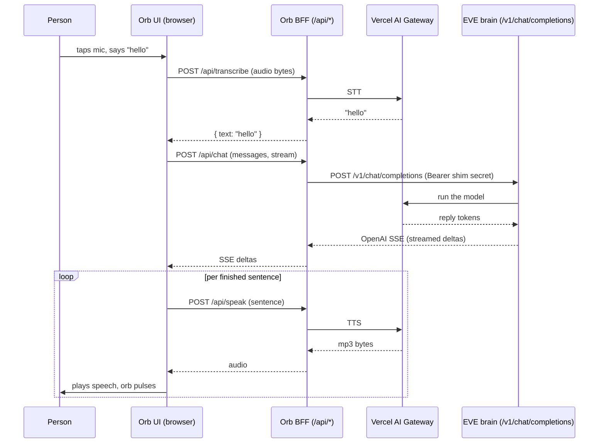
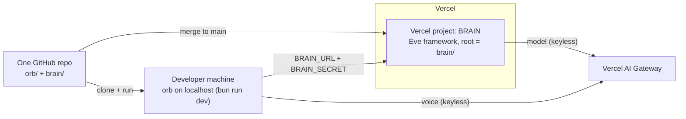

# Architecture

This is the whole system on one page. Four layers, one pattern (Backend-for-Frontend), and the path a
single spoken "hello" travels. Read this before building; the guide steps assume it.

## The four layers

The dashed Memory layer is optional: the foundation ("hello" works) needs only Frontend, Backend, and
the per-turn Context. Memory is added when the user wants it.

## The pattern: Backend-for-Frontend (BFF)

The single rule that makes the rest fall into place:

> The frontend never talks to a model or a third-party service directly. It talks to **one backend the
> user owns**, and that backend talks to everything else.

Why it matters here:

- **Secrets stay server-side.** The browser holds no keys. The model key, the gateway key, and the
  shim secret all live in the backend / BFF routes. If a key is in client code, the pattern is broken.
- **The frontend stays dumb.** It renders, captures a mic, plays audio. It does not know what a model
  is. Swap the brain and the orb does not change.
- **One home per integration.** Every external service is reached from exactly one place. Adding a
  tool, a data source, or a new surface is a backend change, never a frontend scavenger hunt.

There are two BFF hops in this build, and that is intentional:

1. The orb's own server routes (`/api/*`) are the BFF for the **browser** — they hold the gateway voice
   credential and the brain's bearer.
2. The brain's OpenAI-compatible shim is the BFF for **the model and tools** — it holds the model key
   and runs the agent loop.

## A single "hello," end to end

Two details that make the voice feel live, both pinned in `guide/01-frontend.md`:

- The reply is **cut into sentences as it streams**, and each finished sentence is sent to TTS
  immediately. Speech starts before the agent has finished thinking.
- The played audio's amplitude is sampled (Web Audio `AnalyserNode`) into a shared signal the orb
  reads each frame, so the orb **pulses in time with the voice**.

## Deploy topology

- **One Vercel project off the repo.** The brain deploys with its **Root Directory set to `brain/`**
  and Vercel's **Eve** framework preset. It redeploys on merge to `main`.
- **The orb runs on localhost** (`bun run dev`) and reaches the brain by URL (`BRAIN_URL`) with a
  shared bearer (`BRAIN_SECRET`, set to the same value on both). The orb proxies server-side, so there
  is **no CORS** to deal with.
- The brain is bearer-guarded and OpenAI-compatible, so it is safe to expose, and any agent reaches it
  with `base_url + api_key`. The orb holds the gateway key and brain bearer in its server routes, so it
  stays local rather than becoming a public endpoint.
- One subdirectory gotcha (the brain lives in a subfolder of the orb's repo) is covered in
  `guide/05-deploy.md`. Get it wrong and the brain build fails; get it right and it is invisible.
