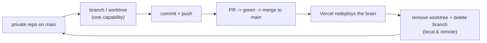

# DevOps: how to run the repo and ship it

This is the process the building agent follows for source control and deploys. It is not optional
hygiene; the deploy model depends on it (Vercel ships when you **merge to `main`**). Keep it simple
and keep it clean.

## 1. One private repo, from the start

The person's agent lives in **their own private repo**. Create it private, never public, never a fork
of a reference.

```bash
# In the project root, after scaffolding orb/ + brain/:
git init
git add -A
git commit -m "chore: initialize"          # first commit on main

# Create it PRIVATE on GitHub and push (needs the gh CLI, authenticated):
gh repo create <name> --private --source=. --remote=origin --push
```

- **Private, always.** This holds the person's keys-adjacent config and their product. Public is a
  leak waiting to happen. (Secrets themselves live in `.env` files that are gitignored — see step 5 —
  but the repo is private regardless.)
- One repo holds **both** `orb/` (root) and `brain/` (subfolder). The brain deploys as one Vercel
  project; the orb runs locally (see `guide/05-deploy.md`).

## 2. Branch, don't commit to `main`

`main` is the deploy branch. Treat it as protected: every change lands through a branch and a merge,
never a direct commit to `main`. This keeps `main` always-deployable and gives a review surface.

```bash
git switch -c feat/<short-name>     # or use a worktree (step 4)
# ...make the change...
git add -A && git commit -m "feat: <what changed>"
git push -u origin feat/<short-name>
```

Scope a branch to **one capability** (one tool, one fix, one guide-step's worth of work). Small
branches review faster and roll back cleaner.

## 3. Merge to deploy

A merge to `main` is the deploy. Open a PR, get it green, merge it; Vercel redeploys the brain on the
merge. No manual `vercel deploy --prod` in the normal flow (an org policy may block it anyway).

```bash
gh pr create --base main --head feat/<short-name> --title "<title>" --body "<what & why>"
# review, then:
gh pr merge <num> --merge      # merge -> Vercel redeploys the brain
```

- **Green before merge.** The brain must `eve build` cleanly; the orb must `next build`. Do not merge
  a red branch to a deploy branch.
- **One capability per PR**, shipped and verified before the next. (This guide repo itself was built
  this way.)

## 4. Worktrees: isolate, then clean up

For parallel or isolated work, use a git worktree so the change is separated from `main` until it is
ready. The rule that matters: **clean them up when the work is merged.** Stale worktrees and stale
branches are how a repo rots.

```bash
# Create an isolated worktree on a new branch:
git worktree add ../wt-<name> -b feat/<name>
# ...work, commit, push, open + merge the PR...

# After the PR is MERGED, remove the worktree AND the branch:
git worktree remove ../wt-<name>          # delete the worktree dir
git branch -D feat/<name>                 # delete the local branch
git push origin --delete feat/<name>      # delete the remote branch
git worktree prune                        # tidy any dangling worktree metadata
```

Checklist after every merged change:

- [ ] PR is merged to `main`.
- [ ] Worktree directory removed (`git worktree remove`).
- [ ] Local branch deleted (`git branch -D`).
- [ ] Remote branch deleted (`git push origin --delete`).
- [ ] `git worktree list` shows only the main checkout; `git branch -a` shows no stale feature branches.

> If your agent harness manages worktrees for you, let it do the cleanup on exit — but verify the
> remote branch is gone too; harnesses often leave the pushed branch behind.

## 5. Secrets never touch git

- Every `.env` / `.env.local` is **gitignored** (the scaffolds set this up). Only `.env.example`
  files, with empty values, are committed.
- Real keys live in two places: the local `.env` files (for dev) and **Vercel project env vars** (for
  prod, set with `vercel env add`). Never in the repo, never in client code, never echoed to a
  terminal log you might paste.
- See `vendors.md` for exactly which keys go where (brain vs orb).

## 6. The loop, summarized



Private repo, branch per change, merge to deploy, clean up after. That is the whole DevOps story for
this project.
