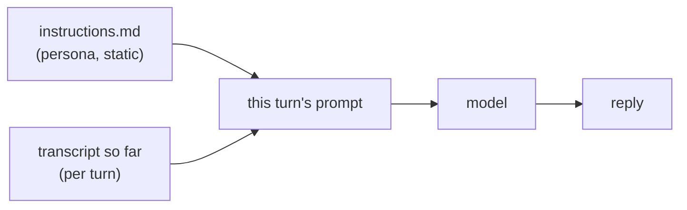

# 03 — Context: what the agent knows during a conversation

The foundation already gives the agent working context. This step is about shaping it deliberately.
Build this when the person wants the agent to feel like *theirs* (a specific persona, house rules,
known facts about them) rather than a generic assistant. It does **not** gate "hello."

## What "context" is

Context is everything the model sees for a single turn. It is assembled fresh every time and thrown
away after. In this build it is two things:

1. **Instructions** — `brain/agent/instructions.md`. Durable across turns within a deployment, but
   static: the agent's identity, voice, and rules. This is the persona.
2. **The transcript** — the conversation so far, fed in per turn by the shim. This is what makes a
   single conversation coherent.

Context is **not** memory. Close the tab and the transcript is gone. Durable, cross-session knowledge
is `04-memory.md`. Keep the two ideas separate: context is "what is in front of the agent right now,"
memory is "what the agent can go look up."



## Shape the persona (instructions.md)

This is the highest-leverage file in the whole system. A few lines change the entire feel. Edit
`brain/agent/instructions.md`. Good structure:

- **Identity** — who the agent is, in the second person ("You are ..."). Name it if the person wants
  a name.
- **Voice** — it is heard, not read. Short, lead with the answer, plain text (no markdown/URLs/lists),
  a brief filler before any pause. Keep these rules; they are why the voice loop feels good.
- **What it can do** — an honest list of current capabilities. At the foundation that is "talk." As
  tools get added (`07-extensibility.md`), list them here so the agent knows to use them, and tell it
  to never invent facts it would need a tool to look up.
- **Behavior / house rules** — anything the person wants enforced. The most useful pattern: **read
  back before acting.** For anything that changes something or matters, have the agent restate what it
  understood in one line and get a clear "yes" first. Voice input gets misheard; this single rule
  prevents most bad turns.

Example skeleton (expand to taste):

```markdown
# Identity
You are <name>, <the person>'s own voice agent. You live behind a glowing orb; they talk to you out
loud and hear you reply. You are <three adjectives that set the tone>.

# Voice
Heard, not read. Short. Lead with the answer. Plain spoken text only. Brief filler before any pause.

# What you can do
- Talk. <list tools here as you add them, with one line each on when to use them.>
Never invent facts you would need a tool to look up.

# Behavior
- Before anything that changes something or matters, read back what you understood in one line and
  get a clear yes first.
- <house rules: tone, topics to avoid, how to handle "I don't know", etc.>
```

## Where the transcript comes from

You do not need to build transcript handling; the shim from `02-backend.md` already does it. Worth
understanding so you can tune it:

- The orb resends the **full message history** each turn (standard OpenAI chat).
- The shim turns that history into a labeled transcript and runs a **fresh stateless EVE session** per
  turn, with the transcript as context. (It deliberately does not resume one long-lived session;
  `02-backend.md` explains why.)
- It prepends a short **voice-mode instruction** so replies stay spoken-style regardless of persona.

Two tuning knobs, if you need them:

- **Long conversations:** the whole transcript is sent every turn, so very long sessions grow the
  prompt. If that becomes a cost or latency issue, summarize older turns before sending, or cap the
  history to the last N turns plus a running summary. (Not needed to start.)
- **Per-turn facts:** to inject something the agent should know for *this* turn only (the current
  date, the page the person is on), add it to the turn text in the shim alongside the transcript. For
  facts that should persist across turns, use memory (`04-memory.md`) instead.

## Add durable known-facts (without full memory)

A lightweight middle ground between static instructions and a memory store: a small **profile** the
agent always sees. Put stable facts about the person in `instructions.md` (or a file the shim reads
and prepends), e.g. "The person's name is X. They run a store called Y. They prefer concise answers."
This is durable and zero-infrastructure. When the set of facts needs to grow, change, or be written
*by the agent itself*, graduate to memory.

Next: `04-memory.md` — give the agent a place to remember things across conversations.
