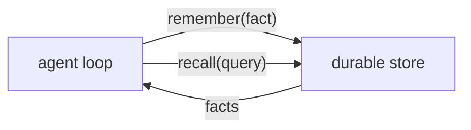

# 04 — Memory: what the agent knows across conversations

Context (`03-context.md`) is what the agent sees during one conversation. **Memory** is what it can
remember across all of them: durable facts it writes on purpose and recalls later. This is optional
and built when the person wants the agent to *learn and retain*. It does not gate "hello."

## The shape of memory

Memory is two tools the agent can call, backed by a durable store:

- **remember** — save a fact ("the person prefers short answers", "the Q3 launch is in October").
- **recall** — fetch relevant facts before answering, so the reply is informed by what it knows.

The agent decides when to use them, the same way it decides to use any tool. In EVE, each is a file in
`agent/tools/`. The only real decision is **what backs the store.**



## Start simple, then graduate

You do not need a database to begin. Two stages:

### Stage 1 — an in-memory / file-backed notes store (works today, no service)

Good enough to wire the tools and prove the loop. A tiny store the two tools share:

```ts
// agent/lib/notes-store.ts — minimal durable-ish notes. Swap the body for a
// real backend (Stage 2) without changing the tools that use it.
const notes: string[] = [];

export function remember(note: string): void {
  const t = note.trim();
  if (t) notes.push(t);
}

export function recall(query?: string): string[] {
  if (!query) return notes.slice(-20);
  const q = query.toLowerCase();
  return notes.filter((n) => n.toLowerCase().includes(q)).slice(-20);
}
```

> This resets when the brain restarts (and on serverless cold starts). It is a stepping stone: it
> proves the tools work. For anything real, do Stage 2. You can also persist Stage 1 across restarts
> by also POSTing each note to a webhook (a Google Sheet, a KV store) — a one-line addition — but that
> gives you storage, not retrieval. For retrieval that actually understands meaning, use Cognee.

The two EVE tools (same in both stages):

```ts
// agent/tools/remember.ts
import { defineTool } from "eve";
import { z } from "zod";
import { remember } from "#lib/notes-store";

export default defineTool({
  description: "Save a durable fact about the person or their world to remember later.",
  parameters: z.object({ note: z.string().describe("The fact to remember, in one short sentence.") }),
  async execute({ note }) {
    remember(note);
    return `Got it. I'll remember: ${note}`;
  },
});
```

```ts
// agent/tools/recall.ts
import { defineTool } from "eve";
import { z } from "zod";
import { recall } from "#lib/notes-store";

export default defineTool({
  description: "Recall durable facts about the person before answering. Call when context would help.",
  parameters: z.object({ query: z.string().optional().describe("What to recall about, if specific.") }),
  async execute({ query }) {
    const hits = recall(query);
    return hits.length ? hits.join("\n") : "Nothing remembered yet.";
  },
});
```

Tell the agent these exist in `instructions.md` ("you can remember and recall facts; recall before
answering when context would help"), or it will not use them.

### Stage 2 — Cognee (the real memory product)

When the person wants memory that is durable, searchable by meaning, and that improves over time, use
**[Cognee](https://www.cognee.ai)**. Cognee builds a knowledge graph from what you store and retrieves
by relevance, not just keyword match, which is what makes recall feel intelligent.

How to integrate it here:

- **Bring your own key — use Cognee Cloud, do not self-host.** The person signs up for Cognee Cloud
  and gets an API key. You integrate over its **REST API** (or its **MCP server**). Do **not** pull in
  the embedded `@cognee/cognee-ts` engine; that is the run-it-yourself path and is the wrong tool for a
  serverless brain.
- Keep the **same two tools** (`remember`, `recall`). Only the store body changes: `remember` POSTs
  the fact to Cognee's add/cognify endpoint; `recall` calls Cognee's search endpoint with the query
  and returns the top results. The agent and the rest of the system do not change at all, because the
  tools are the seam. (This is the BFF idea again: one home for the integration.)
- Put the Cognee key in the **brain's** env (`COGNEE_API_KEY`), never the orb. Memory is a backend
  concern; the frontend never touches it.

Sketch of the Stage-2 store (shape only; check `references.md` for the current Cognee API):

```ts
// agent/lib/notes-store.ts (Stage 2: Cognee Cloud over REST)
const BASE = process.env.COGNEE_API_URL ?? "https://api.cognee.ai";
const KEY = process.env.COGNEE_API_KEY ?? "";
const auth = { authorization: `Bearer ${KEY}`, "content-type": "application/json" };

export async function remember(note: string): Promise<void> {
  // Add the fact, then let Cognee build it into the graph. (Endpoint names per Cognee docs.)
  await fetch(`${BASE}/add`, { method: "POST", headers: auth, body: JSON.stringify({ data: note }) });
}

export async function recall(query: string): Promise<string[]> {
  const res = await fetch(`${BASE}/search`, {
    method: "POST", headers: auth, body: JSON.stringify({ query }),
  });
  if (!res.ok) return [];
  const json = await res.json();
  return Array.isArray(json?.results) ? json.results.map(String) : [];
}
```

> Endpoint paths and payload shapes are Cognee's to define and may change; treat the sketch as the
> wiring pattern and follow Cognee's current REST/MCP docs (`references.md`) for exact calls. The
> point that does not change: **swap the store body, keep the tools, keep memory in the backend.**

## Why this stays clean

Because memory lives behind two tools and one store module, the agent never knows whether it is talking
to an array, a sheet, or a knowledge graph. You can start with the in-memory store to prove the loop,
then graduate to Cognee by editing one file. That is the payoff of the foundation's structure: every
capability has exactly one home, and upgrading it touches exactly that home.

Next: `05-deploy.md` (if you have not deployed yet) or `07-extensibility.md` (add more capability).
